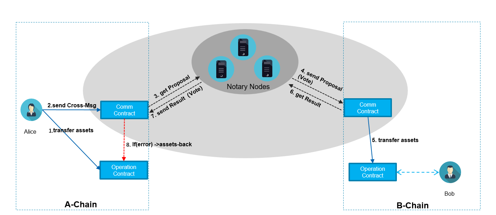

# 框架

我们设计了一套简洁、安全的跨链资产转移协议，并基于BUChain实现了跨链转移资产。
框架图如下：

# 开发手册
开发手册包含测试网介绍、体验跨链、开发说明
[开发手册](https://github.com/zjg555543/bubichain-v3/blob/feature/crosschain/docs/cross_chain/Dev_Manual_CN.md "开发手册")

# 代码目录

[公证人代码](https://github.com/zjg555543/bubichain-v3/tree/feature/crosschain/src/notary "公证人代码")

[通讯合约代码](https://github.com/zjg555543/bubichain-v3/blob/feature/crosschain/docs/cross_chain/cross_comm.js "通讯合约代码")

[资产合约代码](https://github.com/zjg555543/bubichain-v3/blob/feature/crosschain/docs/cross_chain/cross_asset.js "资产合约代码")